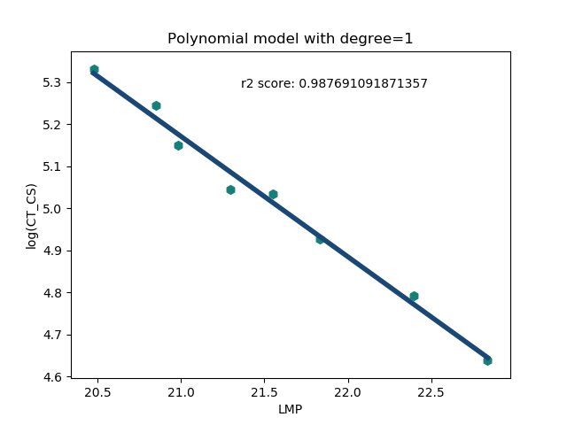
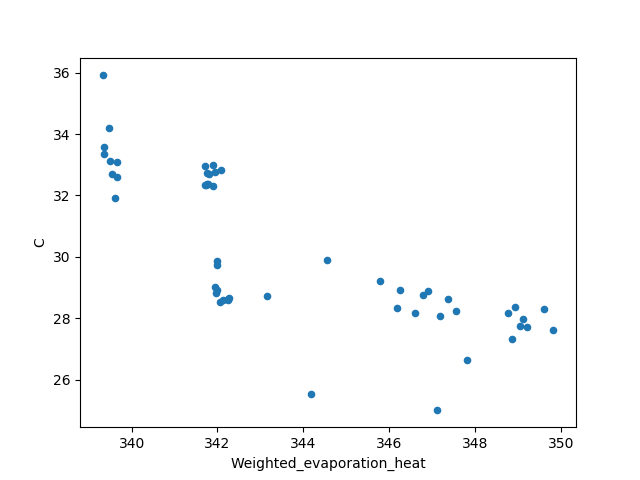

# Xtreme Materials
>A Repository for Lifetime Prediction of High Temperature Alloy Materials

In this repo, we will develop machine learning models to predict the lifetime of alloy materials for high temperature applications.  

## Focus areas:

1. Build a simple physics based model to preserve some form of interpretability
2. Build a data driven machine learning model to get the residual of the physics based model


## TODO list:

- Data collection
- Preprocessing
- Model generation
- Model selection
- Model averaging
    
## Installing / Getting started

To use the codes in this package, you need the following packages:

```shell
numpy>=1.12
sklearn>=0.20.1
matplotlib>=3.1
pandas>=0.25.1
statsmodel>=0.10.1
```

After, you have all the dependencies installed, download the code from the bitbucket repo using:

```shell
git clone ssh://git@stash.pnnl.gov:7999/~visw924/xmat-pnnl.git
```

If you don't have access to bitbucket pnnl stash, you can get it from github private repo:

```shell
git clone git@github.com:mamunm/xmat-pnnl.git
```


I would recommend adding the following line in your `PYTHONPATH`:

```shell
export PYTHONPATH="path/to/xmat_pnnl_code:${PYTHONPATH}"
```

## Features 

What's all the bells and whistles this code can perform:
* Linear regression 

## How to use different modules

The organization of the xmat-pnnl is as follows:


* data_processing: contains processing of individual dataset and then saves the resulting data in a dictionary format in a `.npy` file.
* xmat_pnnl_code: contains the code or wrapper for individual algorithm.
* xmat_pnnl_data: contains the raw data in excel format
* xmat_pnnl_model: models are run and the results are stored in this folder

In the below, I will mainly document all the code or wrapper for different algorithm and how to use them.

### Loading data and saving them 

`load_data` will ease loading the data into nice `pd.DataFrame` format. Below I demonstrate a code to quickly load the data:

```python
import numpy as np
import pandas as pd
import xmat_pnnl_code as xcode 
import mendeleev # To use atomic properties

#Load the data
data_df, features_description, alloy_metadata = xcode.load_data(
    data_file='9Cr_Data')
#Get the weighted atomic number for each alloy
ele = [k for k, v in features_description.items() if 'Element' in v]
AN = {k: getattr(mendeleev, k).atomic_number for k in ele}
data_df['Weighted_AN'] = data_df[ele].mul(AN, axis=1).sum(axis=1)/100

#Save the cleaned data into a csv for future reference
data_df.to_csv('Cleaned_data.csv', index=False)
np.save('features.npy', features_description)
alloy_metadata.to_csv('alloy_metadata.csv')
```

This `xcode.load_data` will load the data. The argument to this function can be either `9Cr_Data` or `Aus_Steel_Data`. Depending on the argument it will load either of the above data and it will return the data in a dataframe format, feature description as a dictionary format, and alloy metadata into another dataframe format.

Here, I also added weighted atomic number to the dataframe as it will be useful later in our model building process. Then I saved the dataframes as csv file and the dictionary as a `npy` file. 

### Data Cleaning

I already added some data cleaning as part of the `load_data` but we need more than that to handle noise in the data. I manually tried to look into the data for anomaly but without a physical basis it would be hard to quantify the utility of each data point. To better understand the data, I found Larson-Miller parameter (LMP) for stress-time-temperature dependence. 

Below I show some plots for LMP:


Clearly, it looks like LMP parameter is very successful in capturing the major physics governing the time-temperature dependence of creep rutpture time. At this point, it would be a automatic choice to use LMP as the basis for our simple physical model and we can run Gaussian Process on top of that to supplement other factors. Also, I will use LMP as the basis for data cleaning purpose. For data cleaning, I use Shapley value. It's a concept developed in game theory to find out the utility of each player in a multi-player game. I'll write the detail scientific explanation of it in the paper. 

To use the `LMP` and `Shapley` code to find out the utility of each data point, please see the code below:

```python
import pandas as pd
import numpy as np
from xmat_pnnl_code import PolyFit
from xmat_pnnl_code import Shapley

ID = [1, 24, 25, 26, 27, 28, 29, 30, 31, 32, 33, 34, 35, 36, 37, 38,
      43, 44, 45, 46, 47, 48, 49, 50, 51, 52, 53, 54, 55, 58, 59, 60,
      61, 62, 63, 64, 65, 66, 67, 68, 69, 70, 71, 72, 73, 74, 75, 76,
      77, 78, 79, 80, 82]
ID = ['9Cr-{}'.format(str(i).zfill(3)) for i in ID]
data = pd.read_csv('../Cleaned_data.csv')
keep_column = ['ID', 'CT_Temp', 'CT_CS', 'CT_RT']
data = data[keep_column]
C = 25
data['LMP'] = 1e-3 * (data['CT_Temp']) * (np.log(data['CT_RT']) + C)

for alloy_id in ID:
    df = data[data['ID'] == alloy_id]
    poly = PolyFit(df=df[['LMP', 'CT_CS']], target='CT_CS', degree=2)
    poly.fit()
    print('Score for {}: {}'.format(alloy_id, poly.score))
    poly.plot_model(text='Score for {}: {}'.format(
        alloy_id, poly.score)).savefig(
                'poly_fit_curves/{}.png'.format(alloy_id))
    plt.clf()

    shapley = Shapley(df=df[['LMP', 'CT_CS']], target='CT_CS', degree=2)
    phi, phi_percentage = shapley.get_phi()
    df['shapley'] = phi
    df['shapley_percentage'] = phi_percentage
    print(df)
    df.to_csv('shapley_values/{}.csv'.format(alloy_id))
```

Running the shapley code produces the following output:

```shell
        ID  CT_Temp    CT_CS    CT_RT        LMP   shapley  shapley_percentage
0  9Cr-001    650.0  206.843    665.8  20.475643  0.127089           12.896406
1  9Cr-001    650.0  189.606   1187.5  20.851744  0.120868           12.265177
2  9Cr-001    650.0  172.369   1454.0  20.983348  0.121536           12.332889
3  9Cr-001    650.0  155.132   2344.0  21.293749  0.119407           12.116898
4  9Cr-001    650.0  153.753   3469.0  21.548554  0.120725           12.250578
5  9Cr-001    650.0  137.895   5388.0  21.834754  0.123645           12.546918
6  9Cr-001    650.0  120.658  12730.0  22.393616  0.125027           12.687171
7  9Cr-001    650.0  103.421  25234.0  22.838366  0.127163           12.903962
```

Problem: This code is very slow as computing the shapley value leads to combinatorial explosion for large number of samples. We may need to use EMSL's computing power, if possible. 

** Note: it would be a nice scientific paper to find the `C(T)` from first principles calculations.


## C matching scheme

Another idea I'm trying is building a predictive model for the C(T, material) of LMP equation. We know that LMP should follow a universal master curve but since we don't know the material and temperature specific constant (which we assumed to be 25 for all cases), we get different curve for different alloy system. My idea was that if we can predict specific C for each alloy than we can use one LMP equation for all the alloy. To implement this idea, I wrote a code that will try to find the C that will yield the maximum utility for each alloy with respect to the reference alloy system. The algorithm is summarized below:

1. Find the reference model and store it to make future prediction.
2. Now, initialize the optimization with a seed C value (I used 25)
3. get the score that corresponds to this LMP
4. Use scipy.optimize.fmin to get the optimum C value

When I used quadratic equation for the LMP model, my converged score were very poor in comparison to the native model score. 

```shell
Alloy          native    Converged  Difference
ID             score     score
9Cr-001   :   0.985460   0.985460   0.000000
9Cr-024   :   0.967858   0.796379   0.171479
9Cr-025   :   0.969674   0.782235   0.187439
9Cr-026   :   0.944988   0.756337   0.188650
9Cr-027   :   0.953035   0.794080   0.158956
9Cr-028   :   0.957454   0.842460   0.114993
9Cr-029   :   0.963882   0.923481   0.040401
9Cr-030   :   0.920761   0.741371   0.179390
9Cr-031   :   0.957299   0.633809   0.323490
9Cr-032   :   0.955604   0.728485   0.227119
9Cr-033   :   0.964690   0.847679   0.117011
9Cr-034   :   0.955508   0.841343   0.114165
9Cr-035   :   0.892425   0.190097   0.702328
9Cr-036   :   0.968152   0.777269   0.190883
9Cr-037   :   0.957900   0.777518   0.180382
9Cr-038   :   0.901355   0.160278   0.741077
9Cr-043   :   0.950264   0.735930   0.214334
9Cr-044   :   0.950957  -2.271157   3.222114
9Cr-045   :   0.951751  -1.798770   2.750521
9Cr-046   :   0.956075  -1.346661   2.302736
9Cr-047   :   0.954882  -1.831709   2.786590
9Cr-048   :   0.955411  -1.719256   2.674667
9Cr-049   :   0.965111  -2.795596   3.760707
9Cr-050   :   0.950353  -1.854816   2.805169
9Cr-051   :   0.968716  -2.078190   3.046906
9Cr-052   :   0.957131  -1.505532   2.462663
9Cr-053   :   0.965246  -2.997341   3.962588
9Cr-054   :   0.976627  -2.967974   3.944602
9Cr-055   :   0.958634   0.858227   0.100407
9Cr-058   :   0.957414   0.583181   0.374233
9Cr-059   :   0.958473   0.283372   0.675100
9Cr-060   :   0.937985   0.713322   0.224663
9Cr-061   :   0.967107   0.821322   0.145784
9Cr-062   :   0.961953   0.832017   0.129937
9Cr-063   :   0.970352   0.860304   0.110049
9Cr-064   :   0.871318   0.733738   0.137580
9Cr-065   :   0.944139   0.564356   0.379783
9Cr-066   :   0.935804   0.800466   0.135337
9Cr-067   :   0.992766   0.885757   0.107010
9Cr-068   :   0.986818   0.820517   0.166301
9Cr-069   :   0.979048   0.883209   0.095839
9Cr-070   :   0.959300   0.932539   0.026761
9Cr-071   :   0.957543   0.921532   0.036010
9Cr-072   :   0.959529   0.917995   0.041534
9Cr-073   :   0.948541   0.899387   0.049154
9Cr-074   :   0.948943   0.899030   0.049914
9Cr-075   :   0.946294   0.901225   0.045069
9Cr-076   :   0.936709   0.917189   0.019520
9Cr-077   :   0.950270   0.904520   0.045750
9Cr-078   :   0.944435   0.891029   0.053406
9Cr-079   :   0.937483   0.616791   0.320692
9Cr-080   :   0.943163   0.298161   0.645002
9Cr-082   :   0.975563   0.935110   0.040453
```

In order to get better converged value, I plotted the LMP as `log(stress) vs LMP`. Below is the three representative curves for that:




With this equation, our converged score agree very well with the native score except for alloy `9Cr-080`. I need to look further into the data. But I think we can use the converged `C` values to build a predictive model now.

```shell
Alloy          native    Converged  Difference
ID             score     score
9Cr-001   :   0.987691   0.987691   0.000000
9Cr-024   :   0.941155   0.945690  -0.004535
9Cr-025   :   0.934851   0.939127  -0.004276
9Cr-026   :   0.932081   0.947176  -0.015095
9Cr-027   :   0.918518   0.915534   0.002984
9Cr-028   :   0.922469   0.928989  -0.006520
9Cr-029   :   0.937528   0.956385  -0.018858
9Cr-030   :   0.919338   0.901311   0.018026
9Cr-031   :   0.928749   0.871088   0.057661
9Cr-032   :   0.936728   0.890224   0.046505
9Cr-033   :   0.941000   0.916422   0.024578
9Cr-034   :   0.943001   0.893947   0.049054
9Cr-035   :   0.852745   0.856983  -0.004238
9Cr-036   :   0.943034   0.942969   0.000065
9Cr-037   :   0.950390   0.932195   0.018195
9Cr-038   :   0.868061   0.853396   0.014665
9Cr-043   :   0.925977   0.924942   0.001036
9Cr-044   :   0.942126   0.962283  -0.020157
9Cr-045   :   0.935053   0.975960  -0.040908
9Cr-046   :   0.934580   0.979138  -0.044558
9Cr-047   :   0.934309   0.973261  -0.038952
9Cr-048   :   0.924836   0.975048  -0.050212
9Cr-049   :   0.959383   0.960293  -0.000910
9Cr-050   :   0.926278   0.970679  -0.044401
9Cr-051   :   0.950010   0.978607  -0.028597
9Cr-052   :   0.928884   0.975902  -0.047018
9Cr-053   :   0.961290   0.957828   0.003462
9Cr-054   :   0.972875   0.972345   0.000529
9Cr-055   :   0.922453   0.905731   0.016723
9Cr-058   :   0.934315   0.946802  -0.012486
9Cr-059   :   0.881979   0.861944   0.020035
9Cr-060   :   0.924867   0.935296  -0.010429
9Cr-061   :   0.945039   0.942747   0.002293
9Cr-062   :   0.899394   0.911713  -0.012319
9Cr-063   :   0.944614   0.961081  -0.016467
9Cr-064   :   0.912375   0.947590  -0.035214
9Cr-065   :   0.931727   0.923376   0.008351
9Cr-066   :   0.944689   0.930558   0.014131
9Cr-067   :   0.946238   0.939959   0.006279
9Cr-068   :   0.963087   0.912079   0.051008
9Cr-069   :   0.965227   0.960016   0.005211
9Cr-070   :   0.931970   0.920428   0.011542
9Cr-071   :   0.927307   0.902193   0.025114
9Cr-072   :   0.914422   0.884241   0.030181
9Cr-073   :   0.928457   0.931245  -0.002788
9Cr-074   :   0.914305   0.877695   0.036610
9Cr-075   :   0.907114   0.881785   0.025329
9Cr-076   :   0.942014   0.921113   0.020901
9Cr-077   :   0.912660   0.892783   0.019877
9Cr-078   :   0.926579   0.926259   0.000320
9Cr-079   :   0.906853   0.910842  -0.003989
9Cr-080   :   0.852456   0.486062   0.366394
9Cr-082   :   0.958195   0.956602   0.001594
```

## Modeling C:

If for a specific alloy system, we have C available (such as for all the above alloy materials), we will prefer using them. Otherwise, we will make a model to parameterize the C for unknown materials. In this exercise, we used Gaussian Process Regression to parameterize the model (I tried linear and polynomial regression but the performance is not satisfactory) and Shapley value to quantize the feature importance.

At first let's look at the scatter plot of different features:





Now, let's run our GP regressor in this data:

```python
import numpy as np
import pandas as pd
from sklearn.linear_model import LinearRegression
import matplotlib.pyplot as plt
import seaborn as sns
from xmat_pnnl_code import ProcessData
from xmat_pnnl_code import SKGP
from sklearn.gaussian_process.kernels import (RBF, WhiteKernel,
        DotProduct, Matern)

#Load the data
path = '/Users/mamu867/PNNL_Code_Base/xmat-pnnl/data_processing/9Cr_data/LMP/'
data = np.load(path + 'constant_matcher_score_lib.npy', allow_pickle=True)[()]
del data['9Cr-080'] #questionable action

#Load the features
path = '/Users/mamu867/PNNL_Code_Base/xmat-pnnl/data_processing/9Cr_data/'
path += 'Generate_New_Fingerprints/fingerprints_data.csv'
df = pd.read_csv(path)

agg_data = []

f_col = [i for i in df.columns if i.startswith('Weighted')]

for k, v in data.items():
    SRS = df[df.ID == k].iloc[0]
    f = [SRS[i] for i in f_col]
    agg_data.append([k] + f + [v['C']])

columns=['ID'] + f_col + ['C']

df = pd.DataFrame(agg_data, columns=columns)

'''
#Explore individual model
features = ['Atomic Number', 'Melting Point', 'Metallic Radius']
for fp in features:
    lr = LinFit(df=df[[fp, 'C']], target='C', prop=fp)
    lr.fit()
    print('Score for {}: {}'.format(fp, lr.score))
    lr.plot_model().show()
    plt.clf()
    lr.plot_parity().show()
    plt.clf()

g = sns.PairGrid(df, x_vars=[i for i in df.columns if i not in['ID', 'C']],
        y_vars='C')
g = g.map(plt.scatter)
plt.show()
'''

'''
for i in df.columns:
    if i in ['ID', 'C']:
        continue
    df.plot(x=i, y='C', kind='scatter')
    plt.savefig('scatter_plot/{}.png'.format(i))
    plt.clf()
'''

X = df[[i for i in df.columns if i not in ['ID', 'C']]].to_numpy()
y = df['C'].to_numpy()

pd = ProcessData(X=X, y=y, metadata=[i for i in df.columns
    if i not in ['ID', 'C']])
pd.clean_data()
X, y, metadata = pd.get_data()
del pd

kernel = 1.0*RBF(length_scale=1.0) + WhiteKernel(noise_level=1.0)
kernel += 1.0*DotProduct(sigma_0=1.0) + 1.0*Matern(length_scale=1.0)
skgp = SKGP(X=X, y=y, kernel=kernel, validation='leave_one_out')
skgp.run_GP()
skgp.__dict__['features'] = metadata
print(skgp.__dict__)

np.save('gp_run.npy', skgp.__dict__)
skgp.plot_parity(data='train', err_bar=True).savefig(
        'train_parity_plot.png')
skgp.plot_parity(data='test', err_bar=True).savefig(
        'test_parity_plot.png')

```


When we run this script, we see the follwing results for the prediction of C:

```shell
RMSE_test: 1.0655048795161435
RMSE_train: 0.05354776913232841
MAE_test: 0.6874357759093291
MAE_train: 0.01539474566385372
r2_score_test: 0.8134786841660422
r2_score_train: 0.9995289138356854
final_kernel: 36.8**2 * RBF(length_scale=2.4e+04) + WhiteKernel(noise_level=0.00644) + 8.72**2 * DotProduct(sigma_0=0.0377) + 1.28**2 * Matern(length_scale=0.0688, nu=1.5)
log_marginal_likelihood: -80.07324458836766
```

And the parity plot for train and test set is shown below:


Now, we want to know the importance of different features on the prediction. In other words, we want to know which features are essential for the prediction. To quantify the importance of different features, I used shapley value:

```python
import numpy as np
from itertools import combinations
from xmat_pnnl_code import ShapleyFeatures
import pandas as pd

data = np.load('gp_run.npy', allow_pickle=True)[()]

df = pd.DataFrame(data['X'], columns=data['features'])
df['C'] = data['y']

shapley_information = ShapleyFeatures(df=df,
        target='C', features=data['features']).get_phi()

np.save('shpaley_information.npy', shapley_information)
```

Running this code produces the following summary:

```shell
Feature                                      Phi       Phi%
Weighted_AN                                0.196432  19.643942
Weighted_atomic_weight                     0.225525  22.553312
Weighted_boiling_point                     0.191836  19.184259
Weighted_dipole_polarizability            -0.252747 -25.275671
Weighted_evaporation_heat                  0.216368  21.637592
Weighted_heat_of_formation                 0.211639  21.164692
Weighted_melting_point                     0.210911  21.091875
```

Note, dipole polarizability is actually detrimental to the performance of our model. If we remove it from our model, we see slight improvements (shown below):

```shell
RMSE_test: 1.0359576912712436
RMSE_train: 0.014247493216071843
MAE_test: 0.658920857679828
MAE_train: 0.007203060215199375
r2_score_test: 0.8236799814289746
r2_score_train: 0.9999666501025785
final_kernel: 5.99**2 * RBF(length_scale=1.57) + WhiteKernel(noise_level=0.00605) + 0.0061**2 * DotProduct(sigma_0=5.25e+03) + 1.31**2 * Matern(length_scale=0.0444, nu=1.5)
log_marginal_likelihood: -78.53469186266094
```

And the parity plot looks like:


Now, we are pretty close to having our simple model finalized. I'll do an overall analysis of the simple model soon.

