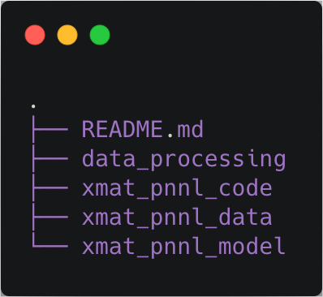
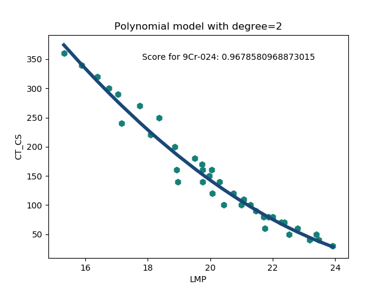
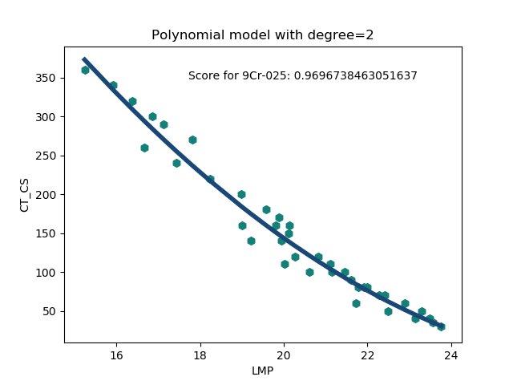

# Xtreme Materials
>A Repository for Lifetime Prediction of High Temperature Alloy Materials

In this repo, we will develop machine learning models to predict the lifetime of alloy materials for high temperature applications.  

## Focus areas:

1. Hyperparameter optimization (grid search, random search, Bayesian, MCC)
2. Getting posterior distribution using MCMC


## TODO list:

- Data collection
- Preprocessing
- Model generation
- Model selection
- Model averaging
    
## Installing / Getting started

To use the codes in this package, you need the following packages:

```shell
numpy>=1.12
sklearn>=0.20.1
matplotlib>=3.1
pandas>=0.25.1
statsmodel>=0.10.1
```

After, you have all the dependencies installed, download the code from the bitbucket repo using:

```shell
git clone ssh://git@stash.pnnl.gov:7999/~visw924/xmat-pnnl.git
```

If you don't have access to bitbucket pnnl stash, you can get it from github private repo:

```shell
git clone git@github.com:mamunm/xmat-pnnl.git
```


I would recommend adding the following line in your `PYTHONPATH`:

```shell
export PYTHONPATH="path/to/xmat_pnnl_code:${PYTHONPATH}"
```

## Features 

What's all the bells and whistles this code can perform:
* Linear regression 

## How to use different modules

The organization of the xmat-pnnl is as follows:



* data_processing: contains processing of individual dataset and then saves the resulting data in a dictionary format in a `.npy` file.
* xmat_pnnl_code: contains the code or wrapper for individual algorithm.
* xmat_pnnl_data: contains the raw data in excel format
* xmat_pnnl_model: models are run and the results are stored in this folder

In the below, I will mainly document all the code or wrapper for different algorithm and how to use them.

### Loading data and saving them 

`load_data` will ease loading the data into nice `pd.DataFrame` format. Below I demonstrate a code to quickly load the data:

```python
import numpy as np
import pandas as pd
import xmat_pnnl_code as xcode 
import mendeleev # To use atomic properties

#Load the data
data_df, features_description, alloy_metadata = xcode.load_data(
    data_file='9Cr_Data')
#Get the weighted atomic number for each alloy
ele = [k for k, v in features_description.items() if 'Element' in v]
AN = {k: getattr(mendeleev, k).atomic_number for k in ele}
data_df['Weighted_AN'] = data_df[ele].mul(AN, axis=1).sum(axis=1)/100

#Save the cleaned data into a csv for future reference
data_df.to_csv('Cleaned_data.csv', index=False)
np.save('features.npy', features_description)
alloy_metadata.to_csv('alloy_metadata.csv')
```

This `xcode.load_data` will load the data. The argument to this function can be either `9Cr_Data` or `Aus_Steel_Data`. Depending on the argument it will load either of the above data and it will return the data in a dataframe format, feature description as a dictionary format, and alloy metadata into another dataframe format.

Here, I also added weighted atomic number to the dataframe as it will be useful later in our model building process. Then I saved the dataframes as csv file and the dictionary as a `npy` file. 

### Data Cleaning

I already added some data cleaning as part of the `load_data` but we need more than that to handle noise in the data. I manually tried to look into the data for anomaly but without a physical basis it would be hard to quantify the utility of each data point. To better understand the data, I found Larson-Miller parameter (LMP) for stress-time-temperature dependence. 

Below I show some plots for LMP:





Clearly, it looks like LMP parameter is very successful in capturing the major physics governing the time-temperature dependence of creep rutpture time. At this point, it would be a automatic choice to use LMP as the basis for our simple physical model and we can run Gaussian Process on top of that to supplement other factors. Also, I will use LMP as the basis for data cleaning purpose. For data cleaning, I use Shapley value. It's a concept developed in game theory to find out the utility of each player in a multi-player game. I'll write the detail scientific explanation of it in the paper. 

To use the `LMP` and `Shapley` code to find out the utility of each data point, please see the code below:

```python
import pandas as pd
import numpy as np
from xmat_pnnl_code import PolyFit
from xmat_pnnl_code import Shapley

ID = [1, 24, 25, 26, 27, 28, 29, 30, 31, 32, 33, 34, 35, 36, 37, 38,
      43, 44, 45, 46, 47, 48, 49, 50, 51, 52, 53, 54, 55, 58, 59, 60,
      61, 62, 63, 64, 65, 66, 67, 68, 69, 70, 71, 72, 73, 74, 75, 76,
      77, 78, 79, 80, 82]
ID = ['9Cr-{}'.format(str(i).zfill(3)) for i in ID]
data = pd.read_csv('../Cleaned_data.csv')
keep_column = ['ID', 'CT_Temp', 'CT_CS', 'CT_RT']
data = data[keep_column]
C = 25
data['LMP'] = 1e-3 * (data['CT_Temp']) * (np.log(data['CT_RT']) + C)

for alloy_id in ID:
    df = data[data['ID'] == alloy_id]
    poly = PolyFit(df=df[['LMP', 'CT_CS']], target='CT_CS', degree=2)
    poly.fit()
    print('Score for {}: {}'.format(alloy_id, poly.score))
    poly.plot_model(text='Score for {}: {}'.format(
        alloy_id, poly.score)).savefig(
                'poly_fit_curves/{}.png'.format(alloy_id))
    plt.clf()

    shapley = Shapley(df=df[['LMP', 'CT_CS']], target='CT_CS', degree=2)
    phi, phi_percentage = shapley.get_phi()
    df['shapley'] = phi
    df['shapley_percentage'] = phi_percentage
    print(df)
    df.to_csv('shapley_values/{}.csv'.format(alloy_id))
```

Problem: This code is very slow as computing the shapley value leads to combinatorial explosion for large number of samples. We may need to use EMSL's computing power, if possible. 

** Note: it would be a nice scientific paper to find the `C(T)` from first principles calculations.
